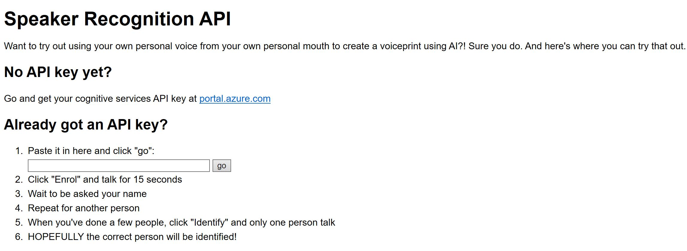
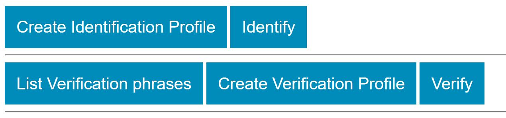
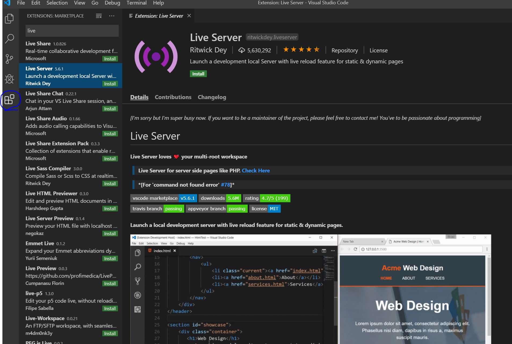
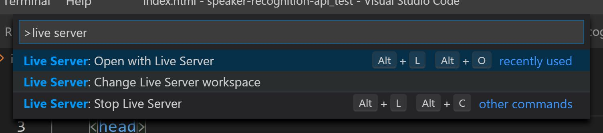
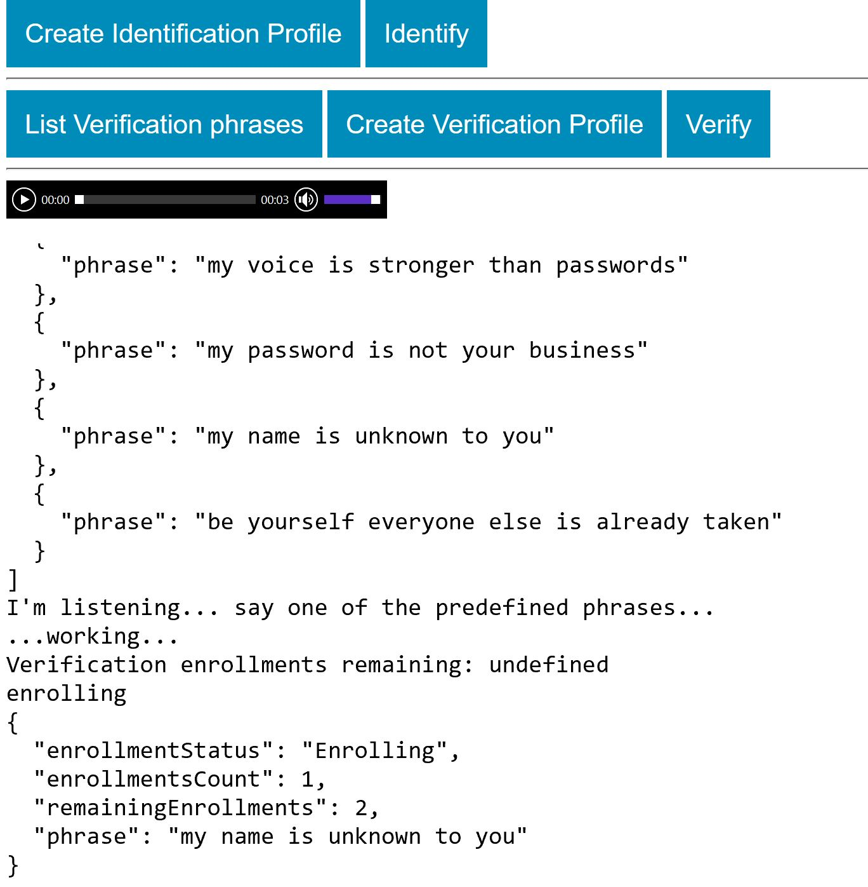
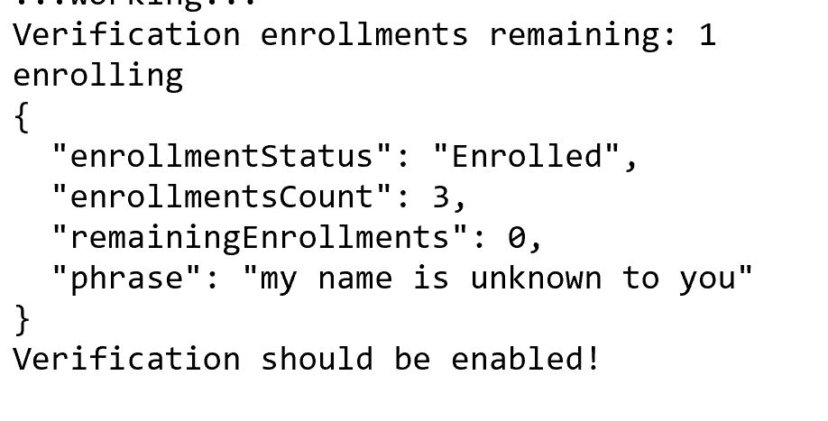
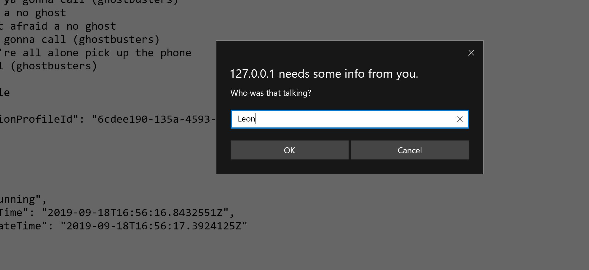
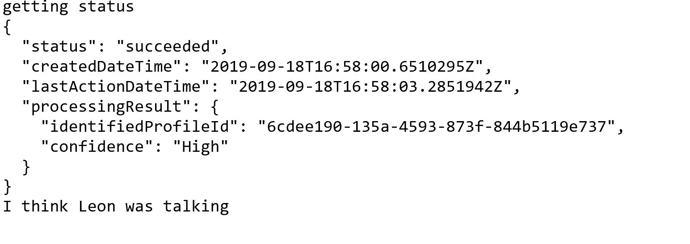

# Speaker-recognition-api-HOL

This is a HOL demo of the Microsoft Cognitive Services Speaker Recognition APIs:

1. Speaker Verification
2. Speaker Identification

By using your browser's built-in audio recording capabilities, and a custom version of the fantastic RecorderJS to convert the raw audio into the format required by Cognitive Services, you can easily have a play around with using your voice as a form of verification and also to identify who is talking out of a group of people.

* [Understand Speaker Recognition API and create Speaker Recognition service for next step](https://docs.microsoft.com/en-us/learn/modules/recognize-voices-with-speaker-recognition/)
* [Learn about the Speaker Recognition API](https://www.microsoft.com/cognitive-services/en-us/speaker-recognition-api)

* [Take a look at the detail API Reference](https://westus.dev.cognitive.microsoft.com/docs/services/563309b6778daf02acc0a508/operations/5645c3271984551c84ec6797)

### After understanding the process of speaker recognition and creating the service, let's try to build a Demo

1. Please download demo Node.js code from [Demo](https://leonstoragesharing.blob.core.chinacloudapi.cn/saphack/speaker-recognition-api_test.zip) and unzip

2. In the uzipped folder, there are two HTML file index.html and demo.html. Please open two html with your default browser. You can see the demo UI has been ready already. 



3. When you click the button there isn't any response. Now, please add the function to build speaker recognition solution demo. 

4. Please launch your Visual Studio Code, in `File -> Open Folder` select the folder you just unzipped.

5. Now, you must be able to see the files in the folder have been uploaded in VS code 


6. Please install extension in VS Code. Select "Extension" menu from the menu in left side and in search box, please input "Live Server"


7. Now, you can take advantage of VS code to edit and debug Node.js code. 

8. Please open file *speaker-recognition-api-demo-core.js* It's empty file. 

#### Firstly let's test Speaker Verification. 

1. We need to know the Verification specific phrases for profile enrollment. Copy following code into the file

```
//-- Speaker Verification methods
// Get the supported verification phrases
function getVerificationPhrases() {
	var phrases = 
		'https://westus.api.cognitive.microsoft.com/spid/v1.0/verificationPhrases?locale=en-US';

	var request = new XMLHttpRequest();
	request.open("GET", phrases, true);

	request.setRequestHeader('Content-Type','multipart/form-data');
	request.setRequestHeader('Ocp-Apim-Subscription-Key', key);
	console.log('Verification phrases:');
	request.onload = function(){ console.log(request.responseText); };
	request.send();
}
```
2. Press `clt+Shift+P` to open the command box, and then input "Live Server: Change Live Server Workspace" and select it. Please select folder as Live Server workspace


3. Select index.html file, and press `clt+Shift+P` to open the command box, and then input "Live Server: Open with Live Server" 

4. Please input the key of Speaker Recognition you created in portal.azure.com. And click "go"

5. Please click "List verification phrase", you will see all supported phrases for profie enrollment. 

6. Now, let's implement create the profile, enrollment and verification. Please put following functions in your *speaker-recognition-api-demo-core.js*

```
// 1. Start the browser listening, listen for 4 seconds, pass the audio stream to "createVerificationProfile"
function enrollNewVerificationProfile(){
	navigator.getUserMedia({audio: true}, function(stream){
		console.log('I\'m listening... say one of the predefined phrases...');
		onMediaSuccess(stream, createVerificationProfile, 4);
	}, onMediaError);
}

// createVerificationProfile calls the profile endpoint to get a profile Id, then calls enrollProfileAudioForVerification
function createVerificationProfile(blob){
	
	// just check if we've already fully enrolled this profile
	if (verificationProfile && verificationProfile.profileId) 
	{
		if (verificationProfile.remainingEnrollments == 0)
		{
			console.log("Verification enrollment already completed");
			return;
		} 
		else 
		{
			console.log("Verification enrollments remaining: " + verificationProfile.remainingEnrollments);
			enrollProfileAudioForVerification(blob, verificationProfile.profileId);
			return;
		}
	}

	var create = 'https://westus.api.cognitive.microsoft.com/spid/v1.0/verificationProfiles';

	var request = new XMLHttpRequest();
	request.open("POST", create, true);
	request.setRequestHeader('Content-Type','application/json');
	request.setRequestHeader('Ocp-Apim-Subscription-Key', key);

	request.onload = function () {
		console.log(request.responseText);
		var json = JSON.parse(request.responseText);
		var profileId = json.verificationProfileId;
		verificationProfile.profileId = profileId;

		// Now we can enrol this profile with the profileId
		enrollProfileAudioForVerification(blob, profileId);
	};

	request.send(JSON.stringify({ 'locale' :'en-us'}));
}

// enrollProfileAudioForVerification enrolls the recorded audio with the new profile Id
function enrollProfileAudioForVerification(blob, profileId){
	addAudioPlayer(blob);

	if (profileId == undefined)
	{
		console.log("Failed to create a profile for verification; try again");
		return;
	}
	
	var enroll = 'https://westus.api.cognitive.microsoft.com/spid/v1.0/verificationProfiles/'+profileId+'/enroll';
  
	var request = new XMLHttpRequest();
	request.open("POST", enroll, true);
	
	request.setRequestHeader('Content-Type','multipart/form-data');
	request.setRequestHeader('Ocp-Apim-Subscription-Key', key);
  
	request.onload = function () {
		console.log('enrolling');
		console.log(request.responseText);

		var json = JSON.parse(request.responseText);

		// need 3 successful enrolled chunks of audio per profile id
		verificationProfile.remainingEnrollments = json.remainingEnrollments;
		if (verificationProfile.remainingEnrollments == 0) 
		{
			console.log("Verification should be enabled!")
		}
	};
  
	request.send(blob);
}

// 2. Start the browser listening, listen for 4 seconds, pass the audio stream to "verifyProfile"
function startListeningForVerification(){
	if (verificationProfile.profileId){
		console.log('I\'m listening... say your predefined phrase...');
		navigator.getUserMedia({audio: true}, function(stream){onMediaSuccess(stream, verifyProfile, 4)}, onMediaError);
	} else {
		console.log('No verification profile enrolled yet! Click the other button...');
	}
}

// 3. Take the audio and send it to the verification endpoint for the current profile Id
function verifyProfile(blob){
	addAudioPlayer(blob);

	var verify = 'https://westus.api.cognitive.microsoft.com/spid/v1.0/verify?verificationProfileId=' + verificationProfile.profileId;
  
	var request = new XMLHttpRequest();
	request.open("POST", verify, true);
	
	request.setRequestHeader('Content-Type','application/json');
	request.setRequestHeader('Ocp-Apim-Subscription-Key', key);
  
	request.onload = function () {
		console.log('verifying profile');

		// Was it a match?
		console.log(request.responseText);		
	};
  
	request.send(blob);
}
```
7. Please use "Live Server" in VS Code, same debug method we used in Step #3 and #4

8. Please click "list verfication phrase" and then "Create Verfication Profile" and select a sentence and say it clearly for first enrollment. 


9. Keep enrollment by clicking "Create Verfication Profile", after 3 times, you will get enrolled status. 

**Note: If you didn't get "enrolled" status for successful enrollment, you couldn't do the verification** 

10. Now, let's try "Verify" Please say exactly same Sentence

#### Let's build Speaker Identification. 
1. Copy the following functions into the js file
```
//-- Speaker Identification methods
// 1. Start the browser listening, listen for 15 seconds, pass the audio stream to "createProfile"
function enrollNewProfile(){
	navigator.getUserMedia({audio: true}, function(stream){
		console.log('I\'m listening... just start talking for a few seconds...');
		console.log('Maybe read this: \n' + thingsToRead[Math.floor(Math.random() * thingsToRead.length)]);
		onMediaSuccess(stream, createProfile, 15);
	}, onMediaError);
}

// createProfile calls the profile endpoint to get a profile Id, then calls enrollProfileAudio
function createProfile(blob){
	addAudioPlayer(blob);

	var create = 'https://westus.api.cognitive.microsoft.com/spid/v1.0/identificationProfiles';

	var request = new XMLHttpRequest();
	request.open("POST", create, true);

	request.setRequestHeader('Content-Type','application/json');
	request.setRequestHeader('Ocp-Apim-Subscription-Key', key);

	request.onload = function () {
		console.log('creating profile');
		console.log(request.responseText);

		var json = JSON.parse(request.responseText);
		var profileId = json.identificationProfileId;

		// Now we can enrol this profile using the profileId
		enrollProfileAudio(blob, profileId);
	};

	request.send(JSON.stringify({ 'locale' :'en-us'}));
}

// enrollProfileAudio enrolls the recorded audio with the new profile Id, polling the status
function enrollProfileAudio(blob, profileId){
  var enroll = 'https://westus.api.cognitive.microsoft.com/spid/v1.0/identificationProfiles/'+profileId+'/enroll?shortAudio=true';

  var request = new XMLHttpRequest();
  request.open("POST", enroll, true);
  
  request.setRequestHeader('Content-Type','multipart/form-data');
  request.setRequestHeader('Ocp-Apim-Subscription-Key', key);

  request.onload = function () {
  	console.log('enrolling');
	console.log(request.responseText);
	
	// The response contains a location to poll for status
    var location = request.getResponseHeader('Operation-Location');

	if (location!=null) {
		// ping that location to get the enrollment status
    	pollForEnrollment(location, profileId);
	} else {
		console.log('Ugh. I can\'t poll, it\'s all gone wrong.');
	}
  };

  request.send(blob);
}

// Ping the status endpoint to see if the enrollment for identification has completed
function pollForEnrollment(location, profileId){
	var enrolledInterval;

	// hit the endpoint every few seconds 
	enrolledInterval = setInterval(function()
	{
		var request = new XMLHttpRequest();
		request.open("GET", location, true);

		request.setRequestHeader('Content-Type','multipart/form-data');
		request.setRequestHeader('Ocp-Apim-Subscription-Key', key);

		request.onload = function()
		{
			console.log('getting status');
			console.log(request.responseText);

			var json = JSON.parse(request.responseText);
			if (json.status == 'succeeded' && json.processingResult.enrollmentStatus == 'Enrolled')
			{
				// Woohoo! The audio was enrolled successfully! 

				// stop polling
				clearInterval(enrolledInterval);
				console.log('enrollment complete!');

				// ask for a name to associated with the ID to make the identification nicer
				var name = window.prompt('Who was that talking?');
				profileIds.push(new Profile(name, profileId));
				console.log(profileId + ' is now mapped to ' + name);
			}
			else if(json.status == 'succeeded' && json.processingResult.remainingEnrollmentSpeechTime > 0) {
				// stop polling, the audio wasn't viable
				clearInterval(enrolledInterval);
				console.log('That audio wasn\'t long enough to use');
			}
			else 
			{
				// keep polling
				console.log('Not done yet..');
			}
		};

		request.send();
	}, 1000);
}

// 2. Start the browser listening, listen for 10 seconds, pass the audio stream to "identifyProfile"
function startListeningForIdentification(){
	if (profileIds.length > 0 ){
		console.log('I\'m listening... just start talking for a few seconds...');
		console.log('Maybe read this: \n' + thingsToRead[Math.floor(Math.random() * thingsToRead.length)]);
		navigator.getUserMedia({audio: true}, function(stream){onMediaSuccess(stream, identifyProfile, 10)}, onMediaError);
	} else {
		console.log('No profiles enrolled yet! Click the other button...');
	}
}

// 3. Take the audio and send it to the identification endpoint
function identifyProfile(blob){
	addAudioPlayer(blob);

	// comma delimited list of profile IDs we're interested in comparing against
	var Ids = profileIds.map(x => x.profileId).join();

	var identify = 'https://westus.api.cognitive.microsoft.com/spid/v1.0/identify?identificationProfileIds=' 
		+ Ids 
		+ '&shortAudio=true';
  
	var request = new XMLHttpRequest();
	request.open("POST", identify, true);
	
	request.setRequestHeader('Content-Type','application/json');
	request.setRequestHeader('Ocp-Apim-Subscription-Key', key);
  
	request.onload = function () {
		console.log('identifying profile');
		console.log(request.responseText);

		// The response contains a location to poll for status
		var location = request.getResponseHeader('Operation-Location');

		if (location!=null) {
			// ping that location to get the identification status
			pollForIdentification(location);
		} else {
			console.log('Ugh. I can\'t poll, it\'s all gone wrong.');
		}
	};
  
	request.send(blob);
}

// Ping the status endpoint to see if the identification has completed
function pollForIdentification(location){
	var identifiedInterval;

	// hit the endpoint every few seconds 
	identifiedInterval = setInterval(function()
	{
		var request = new XMLHttpRequest();
		request.open("GET", location, true);

		request.setRequestHeader('Content-Type','multipart/form-data');
		request.setRequestHeader('Ocp-Apim-Subscription-Key', key);

		request.onload = function()
		{
			console.log('getting status');
			console.log(request.responseText);

			var json = JSON.parse(request.responseText);
			if (json.status == 'succeeded')
			{
				// Identification process has completed
				clearInterval(identifiedInterval);
				var speaker = profileIds.filter(function(p){return p.profileId == json.processingResult.identifiedProfileId});
				
				if (speaker != null && speaker.length > 0){
					console.log('I think ' + speaker[0].name + ' was talking');
				} else {
					console.log('I couldn\'t tell who was talking. So embarrassing.');
				}
			}
			else 
			{
				// Not done yet			
				console.log('still thinking..');
				console.log(json);
			}
		};

		request.send();
	}, 500);
}
```
2. Select "Create Identification Profile" 

3. Please say something about 30 secs for enrolling. And give a name to the profile


4. Selelct "Identify" and say something about 15-30 secs
 

5. You can also delete all profiles with following code
```
//-- If it looks like the profiles are messed up, kick off "BurnItAll" to delete all profile data
// BurnItAll('identification') - clear identification profiles
// BurnItAll('verification') - clear verification profiles
function BurnItAll(mode = 'identification'){
	// brute force delete everything - keep retrying until it's empty
	var listing = 'https://westus.api.cognitive.microsoft.com/spid/v1.0/' + mode + 'Profiles';

	var request = new XMLHttpRequest();
	request.open("GET", listing, true);

	request.setRequestHeader('Content-Type','multipart/form-data');
	request.setRequestHeader('Ocp-Apim-Subscription-Key', key);

	request.onload = function () {
		var json = JSON.parse(request.responseText);
		for(var x in json){
			if (json[x][mode + 'ProfileId'] == undefined) {continue;}
			var request2 = new XMLHttpRequest();
			request2.open("DELETE", listing + '/'+ json[x][mode + 'ProfileId'], true);

			request2.setRequestHeader('Content-Type','multipart/form-data');
			request2.setRequestHeader('Ocp-Apim-Subscription-Key', key);
			request2.onload = function(){
				console.log(request2.responseText);
			};
			request2.send();
		}
	};

	request.send();
}
```
There is [Windows app demo](https://leonstoragesharing.blob.core.chinacloudapi.cn/saphack/speaker-recognition-api_test.zip) you can also try if you have time


